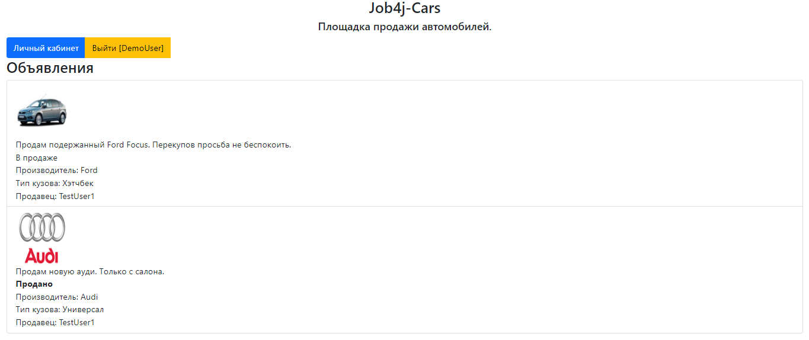
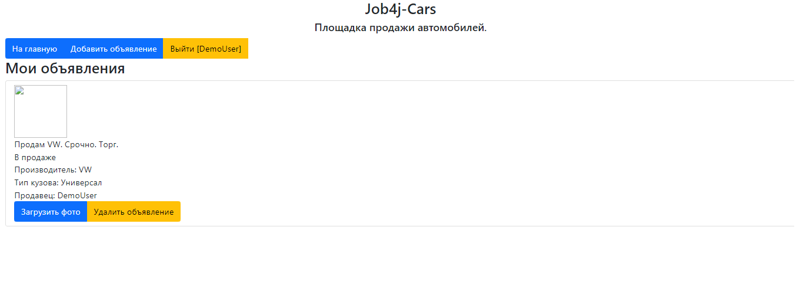
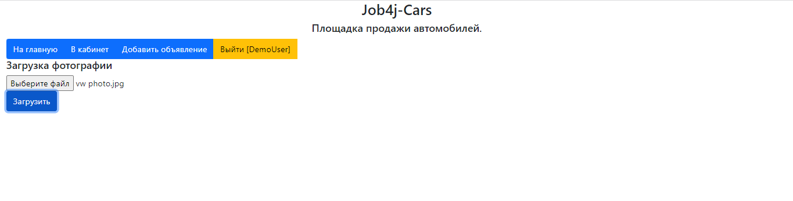
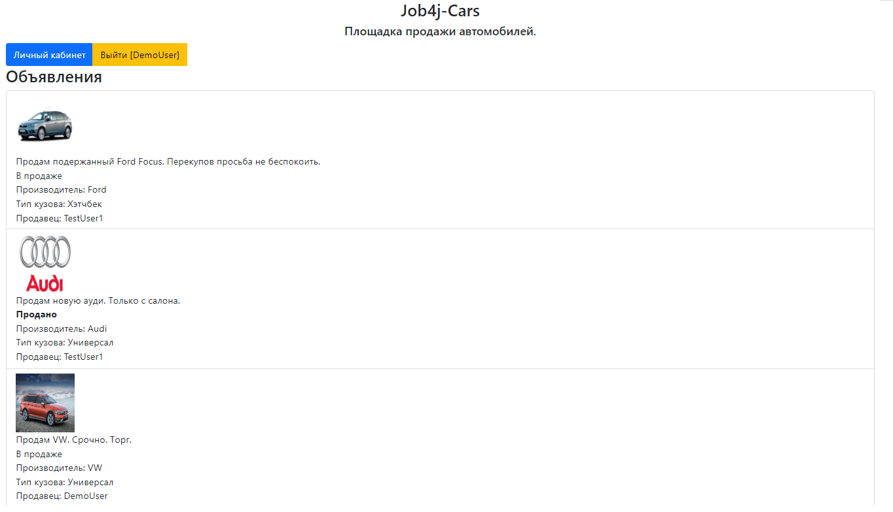

Площадка продажи автомобилей - Job4j-Cars.

Использоване при разработке технологии:

◉ Java Servlet
◉ Hibernate
◉ PostgreSQL
◉ JDBC
◉ Apache Tomcat
◉ JSP/JSTL
◉ Maven

Чтобы пользователь мог воспользоваться всеми функциями приложения, ему необходимо зарегистрироваться:

Затем авторизоваться под своей учетной записью:

Главная страница сайта. На ней видны объявления всех пользователей:

Так как аккаунт новый, в личном кабинете ещё нет объявлений:

Процесс добавления нового объявления:

В личном кабинете видно добавленное объявление. 
Здесь же можно добавть изображение или удалить объявление:

Добавим изображение, чтобы покупатели могли оценить по фото автомобиль:

Отлично, теперь объявление видно на главной странице:

_____________

Никита Игнатов

